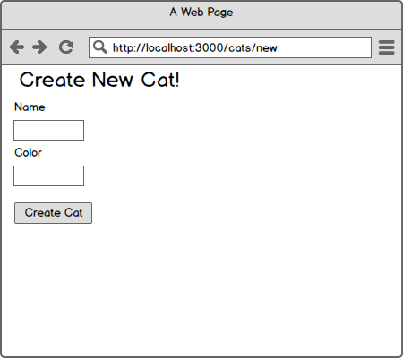

# `http` and CRUD

## Setting the stage

Web application frameworks like [Ruby on Rails](http://rubyonrails.org/), [Express.js](http://expressjs.com/), [Django](https://www.djangoproject.com/) have become commonplace in the web environment. A goal of XP is to be able to get feedback quickly. Frameworks, with the all of the built-in functionality they provide, are one way to help developers ship faster. Django states it proudly and explicitly on the homepage, "The web framework for perfectionists with deadlines."

Like most other things in development, a healthy dose of [pragmatism](http://xkcd.com/386/) is important; frameworks are not a panacea and are not the solution for every type of problem. In this exercise, frameworks will be put to the side; we will use the Node.js _platform_ to build a CRUD application which persists data to MongoDB.

## Jade

We have implicitly been using HTML when doing things like `res.end("my content")`, but now that we are adding dynamic content, building HTML by hand will not work. Take a second to create a sample Node.js web application whose request handler simply calls `res.end("my content")`, next serve the page and inspect it using the [Chrome Inspector](https://developer.chrome.com/devtools#dom-and-styles). What do you observe about the output?

If you are not generally a Front End developer or are unfamiliar with HTML, read through this [MDN Guide](https://developer.mozilla.org/en-US/docs/Web/Guide/HTML/Introduction) with your pair and create a sample document together. You can serve any HTML file locally using `file:///path/to/the.html` in the address bar of Google Chrome. It may be worth it to run your sample document through the [W3C Validator](https://validator.w3.org/) to ensure its correctness.

A typical (valid) HTML document will look something like:

  ```
  <!DOCTYPE html>
  <html lang="en">
  <head>
    <title>A tiny document</title>
  </head>
  <body>
    <div class="container">
      <h1>Main heading in my document</h1>
      <p>I am coding in <abbr title="Hyper Text Markup Language">HTML</abbr>.</p>
    </div>
  </body>
  </html>
  ```

Here is a corresponding example in Node.js which will product this output in the browser:

  ```
  var http = require('http');

  function handleRequest (req, res) {
    if (req.url == '/favicon.ico') {
      res.end();
      return;
    }

    var htmlContent = '<div class="container">' +
      '<h1>Main heading in my document</h1>' +
      '<p>I am coding in <abbr title="Hyper Text Markup Language">HTML</abbr>.</p>' +
      '</div>';

    res.end(htmlContent);
  }

  http.createServer(handleRequest).listen(3000);
  console.log("Server started and listening on port 3000");
  ```

This works _okay_ for a small, simple, static HTML document, but what happens when we try to add dynamic content to this code?

Recall the sample code from earlier:

  ```
  // app.js
  var http = require('http'),
      monk = require('monk');

  var db = require('monk')('localhost/record_query_string_parameters'),
      queryStringCollection = db.get('query_strings');

  function handleRequest (req, res) {
    if (req.url == '/favicon.ico') {
      res.end();
      return;
    }

    var parts = req.url.split('?')[1].split('&'),
        serialized = parts.reduce(function (serialized, pairs) {
          var propAndVal = pairs.split('=');
          serialized[propAndVal[0]] = propAndVal[1];
          return serialized;
        }, {});

    queryStringCollection.insert(serialized, function (err, doc) {
      if (err) throw err;

      res.end('Query String Parameters Persisted!');
    });
  }

  http.createServer(handleRequest).listen(3000);
  ```

Suppose that the requirements change though, as they always will, and we now need to render a list of the persisted Query String Parameters after storing them. For this new feature request, we will need to retrieve each one and build up the HTML output to display an unordered list:

  ```
  // app.js
  var http = require('http'),
      monk = require('monk');

  var db = require('monk')('localhost/record_query_string_parameters'),
      queryStringCollection = db.get('query_strings');

  function handleRequest (req, res) {
    if (req.url == '/favicon.ico') {
      res.end();
      return;
    }

    var parts = req.url.split('?')[1].split('&'),
        serialized = parts.reduce(function (serialized, pairs) {
          var propAndVal = pairs.split('=');
          serialized[propAndVal[0]] = propAndVal[1];
          return serialized;
        }, {});

    queryStringCollection.insert(serialized, function (err, doc) {
      if (err) throw err;

      queryStringCollection.find({}, function (err, docs) {
        var output = '<p>Query String Parameters Persisted!</p>'
        // opening tag for unordered list
        output += '<ul>';
        docs.forEach(function (doc) {
          var documentDetails = [];
          for (var key in doc) {
            documentDetails.push(key + ' => ' + doc[key]);
          }
          output += '<li>' + documentDetails.join(', ') + '</li>';
        });
        // closing tag for unordered list
        output += '</ul>'
        res.end(output);
      });

    });
  }

  http.createServer(handleRequest).listen(3000);
  ```

But this is starting to get very messy. What are some of the problems you see with this code? Take 3-5 minutes to talk with your pair and make a list of issues. Here are a few observations:

  1. It's quickly becoming unmaintainable; as small feature requests are made line count increases rapidly
  1. It conflates responsibilities. Why does a `handleRequest` method also generate HTML?
  1. Relies entirely on humans generating strings which end up as (hopefully) valid HTML later on, which is an error-prone process

But, there is a solution; a _template engine_. For the purpose of this exercise [Jade](http://jade-lang.com/) will be used, but like most other things JavaScript-related, there are [*many* options](https://garann.github.io/template-chooser/) for templating.

Jade is a third-party dependency for Node.js, so we will first have to install it using `npm install` from the directory where this repository is cloned. We will cover more on `npm` next week, for now it is sufficient to understand that is it the Node Package Manager and will help us manage third party dependencies, and that `package.json` contains directives to let `npm` know which libraries should be loaded.

Look at [`jade_example.js`](jade_example.js) and [`example.jade`](example.jade) to see one potential refactoring of the code above. The big ideas in this example are:

  1. `presentDocs` is now a simple method that does one thing and can be tested independently
  1. The template (`example.jade`) contains no logic and simply displays what it is given.

## Your Task

Your task is to create a CRUD application for any resource you would like. This could be `Car`, `House`, `Airplane`, `Cat`, `Dog` - anything you want. Begin by identifying what the attributes for your resource are, for example if you decided to have `Cat` be the resource, there may be fields for `name`, `age`, `weight`, `breed`, `shortHair`, etc.

For this exercise you will not need to write tests, but are encouraged to think about what you would want to test. You are also encouraged to use Jade (as presented here), but are also free to eschew templating engines and handle it by hand in strings; it's completely up to you.

This is an outline of the functionality you are trying to build:

This example is for `GET /cats/new` which renders a form that allows the end user to create a cat upon `POST`-ing the form.



  * `GET /cats`

      Gets view template that displays all (or subset of all) cats.

  * `POST /cats`

      Accepts request to create new resource.

  * `GET /cats/new`

      Responds with a view template to create a new resources.

  * `GET /cats/:id/edit`

      Responds with a view template to edit a resource.

  * `GET /cats/:id`

      Responds with a view template for that resources.

  * `PUT /cats/:id`

      Accepts properties to update a resources.

  * `DELETE /cats/:id`

      Accepts a request to delete a resource.

Recall that (most) browsers only natively support `GET` and `POST`, the other methods are available via AJAX. Given this fact, you may decide to handle update and delete with AJAX or use non-semantic routes instead, like `POST /cars/:id/update` or `POST /cars/:id/delete`, respectively.

_Hint:_ This [StackOverflow Post](http://stackoverflow.com/questions/15427220/how-to-handle-post-request-in-node-js) may be useful for handling `POST` requests.

#### Stretch Goals

If you complete the CRUD exercise above make a commit as a checkpoint of your work using `git`. Next, work through the following stretch goals:

  1. Implement validations

      Working with the example of `Cat`, a potential validation would be something like "Cats must have names", if this condition is not met then the user should see the `/cats/new` form again. Bonus points for surfacing an error message indicating the failed validation.

  1. Non-semantic routing

      If you used any non-semantic routes (e.g. `POST /cats/:id/delete` as opposed to `DELETE /cats/:id`), remove them and replace with a client-side [`XmlHttpRequest`](https://developer.mozilla.org/en-US/docs/Web/API/XMLHttpRequest).

## Reflection

With your pair take 3-5 minutes to read about the [Zone of Proximal Development](https://en.wikipedia.org/wiki/Zone_of_proximal_development) during this exercise were you in your ZPD? Was the work too easy? Too hard? Just right? Do you feel this way as a pair or as individuals?

Next, take time to discuss where you thought you did well and where you struggled. Did cryptic errors slow you down? Were you able to proceed without issue? Are there any takeaways for solving future problems using Node.js?
